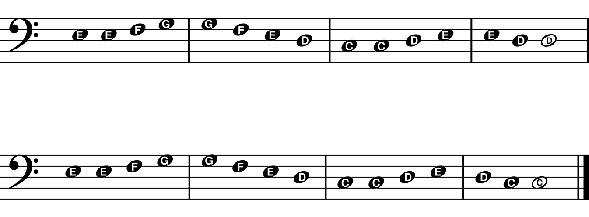

This lesson is about how we write notes on a *staff*.  A staff has **five**
lines, going across the page from left to right. Sometimes, we draw notes on the
lines. Draw four circles on each of the lines of the staff:

We can also draw notes in the **four** spaces between the lines. Finish drawing
this pattern of notes in the spaces:

Now practice writing notes in all **nine** positions, like this. Be neat!

To help us find the notes on the piano, we use *clefs*.  One of the clefs is
called the *bass clef* (say it like BASE CLEF), and it looks like a squiggle
with two dots:

𝄢

Practice drawing some bass clefs here.

The bass clef is also called the "F clef" since it comes from a fancy letter F,
something like this:

ℱ.

Can you draw that fancy F?

The two dots help you find the note **F** on the **line 4** of the staff. Copy
the clef and the F notes three times:

When you put five fingers on notes CDEFG, it's called "C position".
Copy the C position notes two times.

C

  

D

  

E

F

  

G

  

  

Play these notes on the piano, first with your left hand, then with your right
hand.  Try playing in every octave! Now it's time to play a song:

