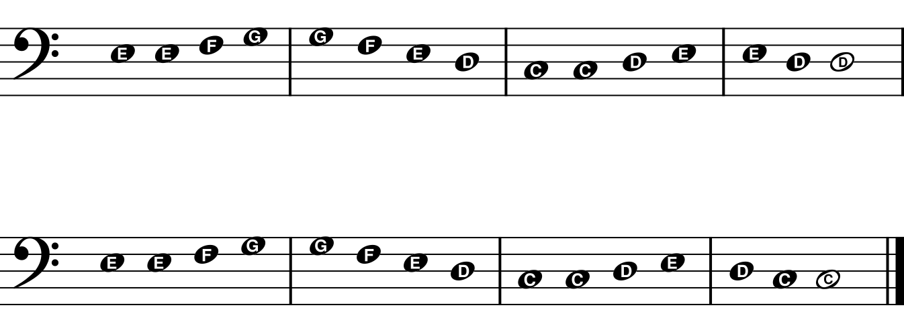

Another important clef is the *treble clef*:

𝄞

Practice drawing some treble clefs here.

The treble clef is also called the "G clef" since it comes from a fancy letter G,
something like this:

𝒢

Can you draw that fancy G?

The treble clef loops around the note **G** on **line 2** of the staff. Copy
the clef and the G notes three times:

Here is how to write the C position notes, starting with G and going *down* to
C. The C does not fit on the staff, so draw an *extra line* through it:

Practice copying the C position notes two times.

Play the notes on the piano, first with your right hand, then with your left
hand.  Try playing in every octave! Now here is a C position song:

